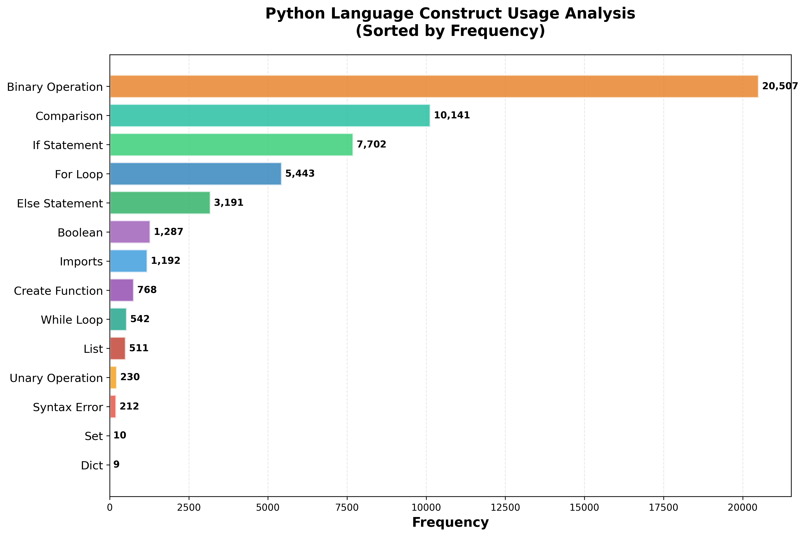
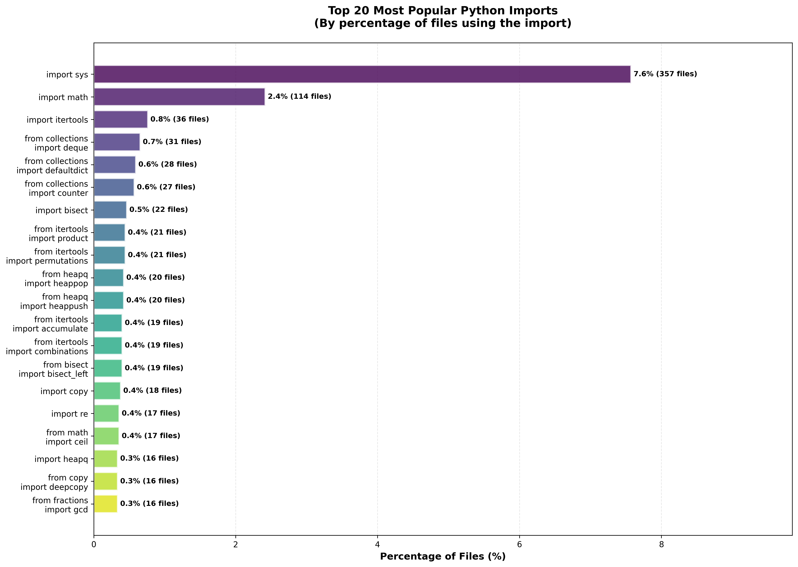

### Compsci 512 Final Project: Applying MapReduce to student programming submissions
#### Owen Sizemore

CodeNet dataset problems used:
1. p00018 
2. p00003 
3. p00005 
4. p00019 
5. p03252 
6. p03285

Hadoop job command example:
```commandline
hadoop jar /usr/lib/hadoop/hadoop-streaming-3.3.6.jar \
    -files
    gs://p00018/jobs/mapper.py,gs://p00018/jobs/reducer.py
    -mapper
    python3 mapper.py
    -reducer
    python3 reducer.py
    -input
    gs://p00018/input/
    -output
    gs://p00018/output-run1/
```



